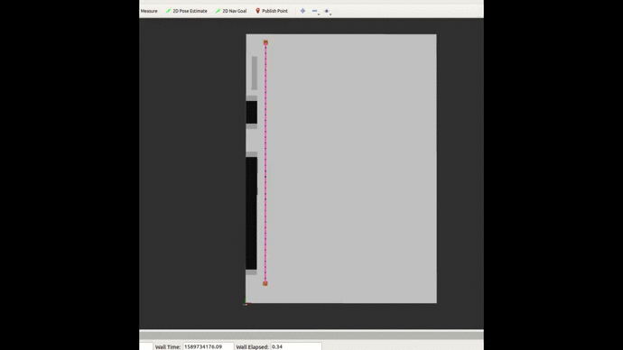
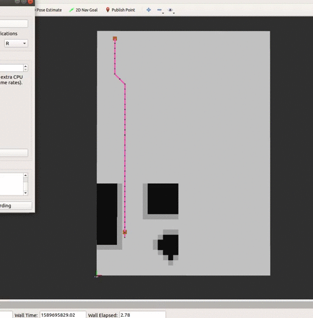

# Global Incremental Planning Algorithms

### Author: Rico Ruotong Jia

### Description
This package currently has 1.Lifelong Planning A* 2. D* Lite 3. a visualization node. The PRM package is used to provide 
a grid map for visualization and planning . 

##### Algorithm Description 
###### Life-long Planning A Star
Life Long planning is an extension of A_star, which evaluates true costs and estimated costs. In LPA star, the goal and the start are fixed, and search starts from the start to the goal.

There are two types of true costs to make the planner adaptive to changes in cell occupancy: g (historical best true cost to a cell), and rhs (the current best true cost). 
When there are no changes in cell occupancy, we always rhs <= g, meaning we will only find better and better true costs (termed overconsistent in the paper).
Then we continuously explore the cell with smallest total estimated cost (termed key in the paper) in a "priority queue", by making them locally consistent (g == rhs), updating their neighbors' rhs, 
and pushing those neighbors to the priority queue if they are locally inconsistent (rhs!=g). The search ends When the goal finally has g == rhs (we know we have explored the goal after updating a series of
cells from the start), and the smallest key on the priority queue is smaller than the goal's key (there are vertices that might generate a cheaper path to the goal). 
 
When some cells become occupied, the rhs cost of associated cells will become greater than g (termed underconsistent in the paper).  

 

###### D Star Lite 
 This is an implementation of the second version of D_star lite proposed by Koenig et al. [See here for the original paper](https://ieeexplore.ieee.org/document/1435479)
 
 An advantage of D_star lite is that it can dynamically replan as the robot moves, using the previously calculated costs at unchanged cells. The search starts from goal and ends at the current robot position. 
 
 One advantage of the 2nd version of D_star lite, is that it does not need to update every node on the priority queue after some cells become occupied. This reduces the number of reordering on the priority queue (in update_vertex() function).
 This is achieved by using the key modifier, k_m, which will guarantee the total estimated costs (in the paper termed "key") maintain the same lower bound as in the first version. 
 Therefore, when we try to find the minimum total estimated cost among vertices, we will get the same result. 
 
 One tiny inefficiency of D_star_lite is that after every update, it might take a few more iterations to get the most updated rhs value of a cell. This is because we only update newly occupied cells and its neighbors at first.
 Therefore, a previously explored vertex with lower rhs values might make a node have an out-dated rhs value. That being said, rhs values will be eventually up-to-date, as vertices are expanded and updated. 
       
 
 
###### Implementation notes
- D_star_lite

    1. One potential flaw of the implementation is that the planner might get into an infinite loop that jumps between two cells (i.e, for one cell, the other has the lowest total true cost), 
which is caused by heuristics selection. 
For example, h = euclidean_distance(a,b) does not work for every test case, however, h = 0.5 * euclidean_distance(a, b) does. 
A not very efficient but safe option is to expand every locally inconsistent node in the priority queue. This way, all cells in the map will be evaluated.

    2. Another implementation detail is the cost function now is Euclidean distance. Compared with Manhattan distance, Euclidean distance reduces overestimation.    

    3. When one vertex becomes occupied during an update, all its neighbors should be updated, too. 
##### Not reachable goal
In both algorithms, If start or goal are not reachable, a ROS_Fatal message will be printed, and the visualization node will die.     

### Usage
To visualize LPA* path, do 
```
$ roslaunch global_planning_algos global_planning.launch algo_select:=3
```

To visualize D* Lite path, do
```
$ roslaunch global_planning_algos global_planning.launch algo_select:=4
```

To change parameters, go to ```prm/config/params.yaml```
