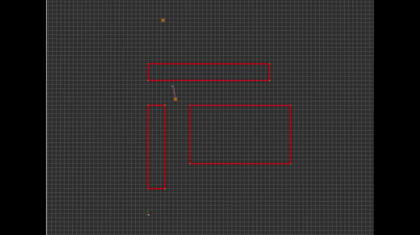

# Potential Field 

### Author: Rico Ruotong Jia

### Description
This package currently has continuous Potential Field (PF) Planner. In the future local minima escape PF (Bushfire & wavefront planner)will be added

##### Algorithm Description 
###### Continuous Potential Field
Potential Field is an elegant, simple to implement global planner that makes use of the concept "potential field". A potential field can be thought 
of as a conservative field, with no obstacle, the goal is the only global minima. Boundaries of obstacles will be form closed-shaped global maximas. 
The addition of global maximas, will make local minimas around obstacles (imagine a bowl with bumps, the downhill area around bumps are local minimas). 
If the robot is not too close to obstacles, we have something like 
 
 
However, if local minimas occur, we must use local minima escape PF. 


 
###### Implementation notes
When the goal is reached, the node will stop and signal the success of reaching the goal. 
When the robot steps into an obstacle, the node will stop and signal the failure. However, this is rare as the potential around obstacles are usually strong enough to
push the robot away. 

However, oscillations will occur around local minima, as a result of the 'tug of war' between repulsive and attractive fields, if their gradients are in opposite directions. 
In the future, non-sticking mechanism should be added.
 
### Usage
To visualize Potential Field path, do 
```
$ roslaunch potential_field potential_field.launch
```
To change parameters, go to ```prm/config/params.yaml```
